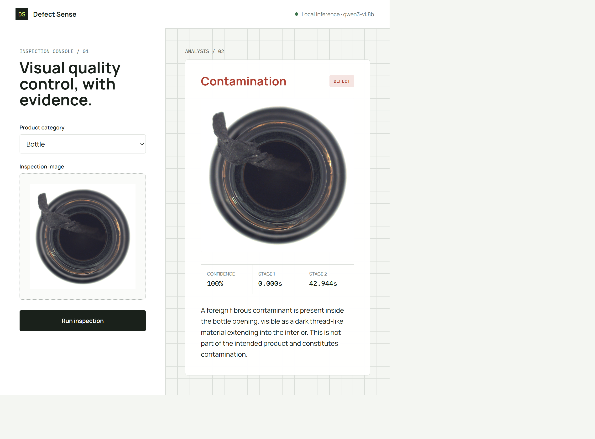
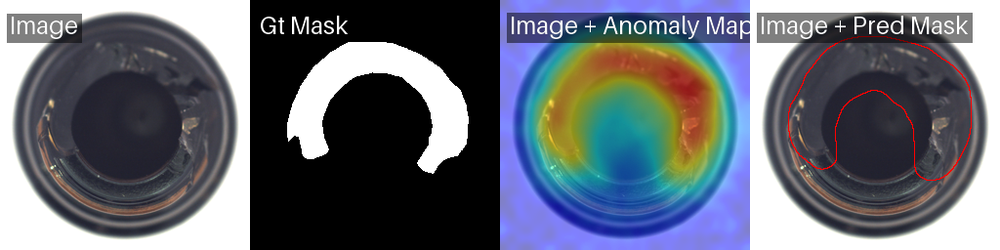
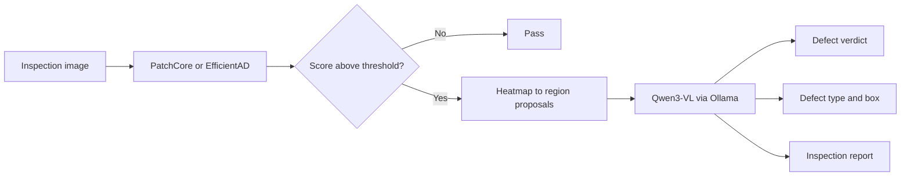

# Defect Sense

[](https://github.com/autrin/defect-sense/actions/workflows/ci.yml)


Production-oriented industrial visual inspection that combines a fast anomaly
detector with local vision-language reasoning. Stage 1 handles throughput and
localization; Stage 2 adjudicates uncertain cases, assigns a defect type, and
produces a concise inspection report.



_Live local inference on an MVTec bottle sample: structured defect verdict,
confidence, stage latency, annotated image, and inspection report._



## Engineering highlights

- **Two-stage inference:** clean samples bypass the VLM; flagged samples carry
  detector evidence into a structured adjudication step.
- **Grounded output:** the VLM receives the source image, anomaly heatmap,
  ranked region proposals, anomaly score, and a closed category taxonomy.
- **Defensive model boundary:** JSON-schema constrained output, taxonomy
  validation, bounding-box clamping, and fail-safe handling of malformed replies.
- **Measurable trade-offs:** image/pixel AUROC and F1, end-to-end precision and
  recall, defect-type accuracy, per-stage latency, and VLM call rate.
- **Local-first operation:** FastAPI, Anomalib, and Ollama; inspection data does
  not need to leave the machine.
- **Testable without accelerators:** pipeline, parsing, region extraction, and
  evaluation math run in CI without a GPU, dataset, or Ollama.

## Architecture



The detector and adjudicator are isolated behind small interfaces. This keeps
the orchestration independent of Anomalib and Ollama, allows deterministic
unit tests, and makes either model boundary replaceable.

## Results

### Validated PatchCore baseline

PatchCore was evaluated across all 15 MVTec AD categories on an RTX 4070
Laptop GPU (8 GB). The tracked source data is in
[`results/patchcore_baseline.csv`](results/patchcore_baseline.csv).

| Metric | Macro mean |
|---|---:|
| Image AUROC | **0.982** |
| Image F1 | **0.972** |
| Pixel AUROC | **0.980** |
| Pixel F1 | **0.581** |

<details>
<summary>Per-category metrics</summary>

| Category | Image AUROC | Image F1 | Pixel AUROC | Pixel F1 |
|---|---:|---:|---:|---:|
| bottle | 1.000 | 0.992 | 0.986 | 0.727 |
| cable | 0.983 | 0.967 | 0.985 | 0.638 |
| capsule | 0.992 | 0.977 | 0.990 | 0.517 |
| carpet | 0.986 | 0.972 | 0.991 | 0.606 |
| grid | 0.986 | 0.965 | 0.982 | 0.389 |
| hazelnut | 1.000 | 0.993 | 0.988 | 0.631 |
| leather | 1.000 | 0.995 | 0.992 | 0.438 |
| metal_nut | 0.999 | 0.989 | 0.987 | 0.841 |
| pill | 0.947 | 0.953 | 0.981 | 0.720 |
| screw | 0.964 | 0.951 | 0.989 | 0.370 |
| tile | 1.000 | 0.994 | 0.956 | 0.620 |
| toothbrush | 0.908 | 0.936 | 0.989 | 0.596 |
| transistor | 0.995 | 0.962 | 0.973 | 0.608 |
| wood | 0.986 | 0.958 | 0.932 | 0.467 |
| zipper | 0.979 | 0.979 | 0.981 | 0.543 |

</details>

Image classification is strong across the benchmark. Localization is the
more interesting constraint: thin structures and small defects produce much
lower pixel F1, particularly for `screw` and `grid`. That gap motivates the
second-stage reasoning and reporting layer.

### VLM-only pilot

A 20-image stratified bottle pilot (five images from each defect class,
including `good`) establishes the Stage 2 ablation baseline:

| Metric | Result |
|---|---:|
| Detection precision | **0.933** |
| Detection recall | **0.933** |
| Detection accuracy | **0.900** |
| Defect-type accuracy | **0.357** |
| Mean latency | **57.1 s/image** |
| VLM call rate | **1.000** |

See [`bottle_summary.json`](results/adjudication/vlm-only/bottle_summary.json)
and [`bottle_records.csv`](results/adjudication/vlm-only/bottle_records.csv).
The pilot is intentionally reported as an ablation, not as proof of two-stage
quality. Its low type accuracy and high latency establish the cost of sending
every image directly to the VLM.

### Two-stage pilot

The same 20-image stratified sample was then evaluated with the trained
PatchCore checkpoint, a `0.5` triage threshold, and prompt version `2.0`:

| Metric | VLM only | Two stage |
|---|---:|---:|
| Detection precision | 0.933 | **1.000** |
| Detection recall | **0.933** | 0.400 |
| Detection accuracy | **0.900** | 0.550 |
| Defect-type accuracy | **0.357** | 0.333 |
| Mean latency | 57.1 s/image | **40.2 s/image** |
| VLM call rate | 1.000 | **0.750** |

See [`two-stage/bottle_summary.json`](results/adjudication/two-stage/bottle_summary.json)
and [`two-stage/bottle_records.csv`](results/adjudication/two-stage/bottle_records.csv).
The detector correctly routed all 15 defects and skipped all five clean images
in this sample. The VLM then rejected nine true defects as false alarms. The
system therefore demonstrates the intended cost reduction, but not an acceptable
quality trade-off: Stage 2 is over-conservative and currently degrades recall.
That negative result is the primary next optimization target, not hidden behind
the strong Stage 1 benchmark.

### EfficientAD comparison status

The tracked EfficientAD CSV is a **preliminary one-epoch run** from the earlier
benchmark implementation. Its mean image AUROC is 0.747 and should not be used
as a paper-equivalent comparison. The current benchmark defaults to 70,000
optimization steps for EfficientAD, matching the training budget described by
the original method, and records the chosen budget in new CSV outputs.

## Quick start

Python 3.11 or 3.12 is recommended. For GPU acceleration, install a PyTorch
build compatible with the local NVIDIA driver before installing the project.

```bash
git clone https://github.com/autrin/defect-sense.git
cd defect-sense
py -3.11 -m venv .venv
source .venv/Scripts/activate       # Git Bash on Windows

python -m pip install --upgrade pip
python -m pip install torch torchvision --index-url https://download.pytorch.org/whl/cu121
python -m pip install -e ".[full,dev]"
```

Verify the environment:

```bash
python -c "import torch; print(torch.cuda.is_available()); print(torch.cuda.get_device_name(0) if torch.cuda.is_available() else 'CPU')"
pytest -q
```

Download MVTec AD from the configured Hugging Face mirror:

```bash
python scripts/download_mvtec.py
```

The dataset is stored under `datasets/MVTecAD/` and is excluded from Git.

## Run the benchmarks

```bash
# PatchCore: all categories; one fit epoch by design
python benchmark.py

# A subset
python benchmark.py bottle hazelnut

# EfficientAD: all categories; 70,000 optimization steps by default
python benchmark.py --model efficient_ad

# Explicit experimental budget
python benchmark.py --model efficient_ad --max-steps 10000
```

Outputs are written to `results/<model>_baseline.csv`. Checkpoints and full
Anomalib run directories are intentionally ignored because of their size.

## Evaluate adjudication

Install [Ollama](https://ollama.com/download), start it, and pull the model:

```bash
ollama pull qwen3-vl:8b
```

Run a small VLM-only ablation:

```bash
python scripts/eval_adjudication.py bottle --mode vlm-only --limit 5
```

Run the actual two-stage pipeline with a locally trained checkpoint:

```bash
python scripts/eval_adjudication.py bottle \
  --mode two-stage \
  --ckpt path/to/model.ckpt \
  --threshold 0.5
```

Each new summary records the Git commit, timestamp, platform, Python and model
dependency versions, evaluation mode, detector, checkpoint, threshold, VLM,
dataset root, and sample limit.

## Inspection console

```bash
export DEFECT_SENSE_CKPT=path/to/model.ckpt
export DEFECT_SENSE_CATEGORY=bottle
uvicorn app.main:app --reload
```

Open <http://localhost:8000>. Without a checkpoint, the application runs in
VLM-only mode. Operational health is available at `GET /healthz`; the OpenAPI
contract is available at `GET /docs`.

Configuration is supplied through environment variables:

| Variable | Default | Purpose |
|---|---|---|
| `DEFECT_SENSE_CKPT` | unset | Local Anomalib checkpoint |
| `DEFECT_SENSE_CATEGORY` | `bottle` | Category associated with the checkpoint |
| `DEFECT_SENSE_VLM` | `qwen3-vl:8b` | Ollama model name |
| `DEFECT_SENSE_THRESHOLD` | `0.5` | Stage 1 triage threshold |
| `DEFECT_SENSE_DATA` | `./datasets/MVTecAD` | Dataset root used for taxonomy discovery |

## Repository map

```text
app/                         FastAPI API and inspection console
scripts/                     Dataset, evaluation, and inspection CLIs
src/defect_sense/
  detectors/                 Anomalib adapter and training policy
  eval/                      Metrics, records, and reproducibility metadata
  pipeline/                  Two-stage orchestration and domain results
  vlm/                       Ollama client, schema, prompt, and parsing
  regions.py                 Heatmap connected components and ranked boxes
  taxonomy.py                MVTec category defect vocabularies
  viz.py                     Heatmap overlays and annotations
tests/                       Accelerator-free unit tests
results/                     Tracked benchmark tables and compact evaluations
```

## Current limitations

- The 20-image two-stage pilot is useful for diagnosis but too small for a
  general performance claim; a full-category evaluation remains future work.
- Qwen3-VL overrules too many true positives in the current prompt, reducing
  recall from 0.933 in the VLM-only pilot to 0.400 in the two-stage pilot.
- Triage threshold calibration is category-specific; `0.5` is an operational
  default, not a universally optimized value.
- The current web process performs synchronous local inference and is intended
  as an engineering demo, not a multi-tenant production service.
- Model checkpoints are not distributed in Git. Reproduce them with the
  benchmark command or provide a local checkpoint explicitly.

## License and data

Source code is licensed under the [MIT License](LICENSE). MVTec AD data and
derived visualizations remain subject to the dataset's
[CC BY-NC-SA 4.0 terms](https://www.mvtec.com/company/research/datasets/mvtec-ad);
they are included for non-commercial research and portfolio demonstration.

## References

- Roth et al., [Towards Total Recall in Industrial Anomaly Detection](https://arxiv.org/abs/2106.08265), CVPR 2022.
- Batzner et al., [EfficientAD: Accurate Visual Anomaly Detection at Millisecond-Level Latencies](https://arxiv.org/abs/2303.14535), WACV 2024.
- Bergmann et al., [MVTec AD](https://www.mvtec.com/company/research/datasets/mvtec-ad), CVPR 2019.
- [Qwen3-VL model card](https://ollama.com/library/qwen3-vl).

Built by Autrin Hakimi.