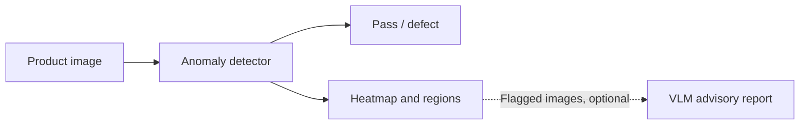

# Defect Sense

[](https://github.com/autrin/defect-sense/actions/workflows/ci.yml)


Visual anomaly detection for industrial inspection. Train on normal product
images, detect defects, and inspect heatmaps and candidate regions through a
web console, REST API, or command line.


## What it does

- **Detect and localize anomalies** with PatchCore, with EfficientAD available
  as an alternative detector through Anomalib.
- **Inspect images locally** with a FastAPI console, annotated results, anomaly
  scores, and per-stage timing. The default path needs no language model.
- **Add optional visual reports** using Qwen3-VL through Ollama. Advisory mode
  can suggest a defect type without changing the detector's verdict or regions.
- **Evaluate reproducibly** with separate calibration and evaluation splits,
  per-image records, input hashes, and detection, localization, and latency metrics.

### How it works



The detector adapter, decision policy, and VLM adapter are separate components.
The API and CLI share the same pipeline. Invalid detector scores raise errors;
unavailable or malformed VLM replies cannot clear a detector flag in advisory mode.
Unit and API tests run without a GPU, dataset, or Ollama.

## Results

**PatchCore on MVTec AD bottle:** 209 normal training images, 20 calibration
images, and 63 evaluation images (48 defective, 15 good), with no overlap between
the splits.

| Metric | Result |
|---|---:|
| Detection precision | 100% |
| Detection recall | 100% |
| Missed defects / false alarms | 0 / 0 |
| Pixel F1 | 0.704 |
| Pixel IoU | 0.543 |
| Mean inference time | 0.30 s/image |

Measured on an RTX 4070 Laptop GPU; latency excludes model loading.
Image decisions use a fixed `0.5` threshold. Pixel metrics use a fixed `0.5`
threshold and aggregate across all evaluation pixels at the original image size.
These results cover one category, not general performance across products or
production conditions.

[Detailed metrics](results/controlled_bottle_20260923/comparison.json)
&middot; [Per-image results](results/controlled_bottle_20260923/detector-only/bottle_records.csv)
&middot; [Split manifest](results/controlled_bottle_20260923/manifest.json)

## Quick start

Use Python 3.11 or 3.12. For GPU training, install a compatible
[PyTorch build](https://pytorch.org/get-started/locally/) before installing the
project dependencies. The commands below use PowerShell.

```powershell
git clone https://github.com/autrin/defect-sense.git
cd defect-sense
python -m venv .venv
.\.venv\Scripts\Activate.ps1
python -m pip install -e ".[full,dev]"
python scripts\download_mvtec.py
python benchmark.py bottle
```

Start the console with the checkpoint produced by training:

```powershell
$env:DEFECT_SENSE_CKPT = "path\to\model.ckpt"
$env:DEFECT_SENSE_CATEGORY = "bottle"
python -m uvicorn app.main:app
```

Open **http://localhost:8000**. API documentation is at `/docs`, image inspection
at `POST /inspect`, and health status at `GET /healthz`.
Checkpoints and datasets are stored locally, not included in the repository.

For optional reports, install [Ollama](https://ollama.com/download), run
`ollama pull qwen3-vl:8b`, and set
`$env:DEFECT_SENSE_DECISION_POLICY = "advisory"` before starting the server.
Without a configured checkpoint, the app runs in VLM-only mode instead.

## Evaluation and tests

```powershell
python scripts\eval_adjudication.py bottle --ckpt path\to\model.ckpt
pytest -q
```

Evaluation writes per-image CSV records and JSON summaries. To compare detector
and VLM policies on the same inputs, use the controlled evaluation:

```powershell
python scripts\eval_controlled.py detector --out-dir results\my_run
python scripts\eval_controlled.py vlm --out-dir results\my_run
python scripts\eval_controlled.py report --out-dir results\my_run --localization
```

Use a new output directory. The VLM stage requires Ollama and resumes saved
calls; reporting verifies the local data and checkpoint before computing metrics.

## What can improve

- **Localization:** small defects and precise boundaries remain harder than
  image-level classification, as the pixel F1 shows.
- **Coverage:** evaluate more categories and real production images with
  separately calibrated thresholds.
- **Defect typing:** optional VLM suggestions achieved 14.6% accuracy on the
  bottle evaluation. They remain experimental, not trusted inspection labels.
- **Serving:** the console uses synchronous inference. Concurrent workloads
  need request queuing and load testing.

## License

Code: [MIT](LICENSE). MVTec AD data and derived visualizations:
[CC BY-NC-SA 4.0](https://www.mvtec.com/company/research/datasets/mvtec-ad),
for non-commercial research and demonstration.

Built by [Autrin Hakimi](https://github.com/autrin).
